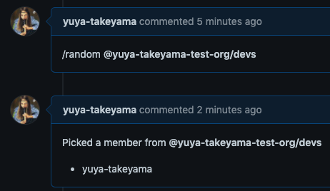

<p align="center">
  <a href="https://github.com/yuya-takeyama/pick-random-member-action"></a>
</p>

# Pick random member

Pick a random member from a team in GitHub Issues/Pull Requests



## Usage

```yaml
on:
  issue_comment:
    types: [created]

jobs:
  commented:
    if: startsWith(github.event.comment.body, '/random ')
    runs-on: ubuntu-latest
    steps:
      - uses: yuya-takeyama/pick-random-member-action@v0.1.0
        with:
          github-token: ${{ secrets.YOUR_GITHUB_TOKEN_WITH_REPO_SCOPE }}
          ignored-members: 'bot1,bot2'
```

## Inputs

| Name              | Required | Default | Description                               |
|-------------------|----------|---------|-------------------------------------------|
| `github-token`    | `true`   |         | GitHub API token                          |
| `ignored-members` | `false`  |         | Comma-separated list of members to ignore |

### Required scopes for `github-token`

* `repo`

`secrets.GITHUB_TOKEN` doesn't work for it.

## Commands

### Pick a member from a team

```
/random @org/team
```

### Pick multiple members from a team

```
/random 3 @org/team
```
